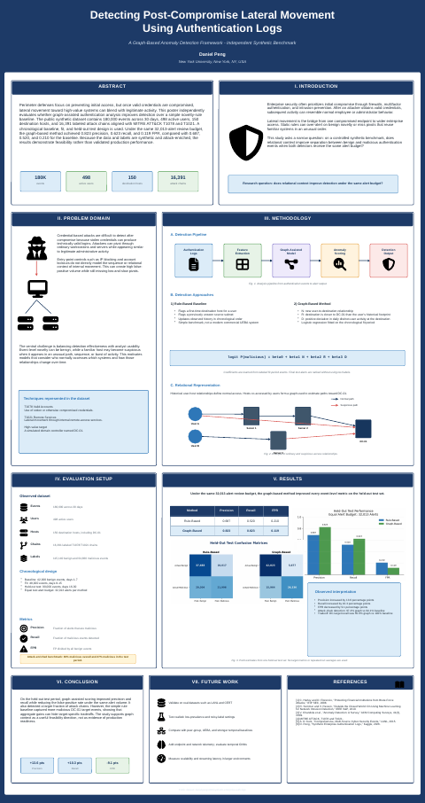

# Graph-Based Lateral Movement Detection

Independent evaluation of rule-based and graph-based approaches for detecting post-compromise lateral movement in synthetic enterprise authentication logs.



## Project overview

This project analyzes **180,000 synthetic authentication events** spanning 30 days. The dataset contains 498 active users, 150 hosts, and 16,391 labeled attack chains aligned with MITRE ATT&CK techniques **T1078 Valid Accounts** and **T1021 Remote Services**.

The analysis compares:

- A two-rule baseline that flags new user-to-host connections and unseen source subnets
- A graph-based detector using edge novelty, path rarity, and host degree deviation
- An equal-alert evaluation in which both detectors generate 32,013 alerts

## Held-out test results

| Method | Precision | Recall | False-positive rate |
|---|---:|---:|---:|
| Rule-Based | 0.6871 | 0.5200 | 0.2100 |
| Graph-Based | 0.8227 | 0.6226 | 0.1190 |

### Confusion matrices

| Method | TP | FP | FN | TN |
|---|---:|---:|---:|---:|
| Rule-Based | 21,996 | 10,017 | 20,304 | 37,683 |
| Graph-Based | 26,336 | 5,677 | 15,964 | 42,023 |

Under the same analyst-review budget, the graph-based detector achieved higher precision and recall while reducing the false-positive rate.

## Repository contents

```text
.
├── README.md
├── requirements.txt
├── notebooks/
│   └── lateral_movement_independent_analysis.ipynb
├── poster/
│   ├── lateral_movement_poster.pdf
│   ├── lateral_movement_poster_editable.pptx
│   └── poster_preview.png
├── docs/
│   └── DATASET.md
├── data/
│   └── README.md
└── results/
    ├── performance_metrics.csv
    ├── confusion_matrices.csv
    └── attack_diagnostics.csv
```

## Run the notebook

Install the dependencies:

```bash
pip install -r requirements.txt
```

Open the notebook:

```bash
jupyter notebook notebooks/lateral_movement_independent_analysis.ipynb
```

The notebook downloads the public dataset directly from Kaggle using `kagglehub`:

```python
dataset_path = kagglehub.dataset_download(
    "danielpeng1995/synthetic-enterprise-auth-logs"
)
```

## Dataset

The CSV is maintained on Kaggle rather than duplicated in this repository:

https://www.kaggle.com/datasets/danielpeng1995/synthetic-enterprise-auth-logs

See [`docs/DATASET.md`](docs/DATASET.md) for the dataset description, experimental structure, fields, intended uses, and limitations.

## Methodology

The events are split chronologically:

- Days 1 through 7 establish baseline behavior
- Days 8 through 15 fit the graph model
- Days 16 through 30 form the held-out test period

The graph-based model uses:

- **Edge novelty:** whether a user-to-host relationship is new
- **Path rarity:** whether an event moves toward the domain controller through an unusual graph path
- **Degree deviation:** whether a host experiences an abnormal increase in distinct users

Logistic regression combines the features into an anomaly score. The primary comparison matches the graph detector's alert count to the rule-based baseline.

## Scope and limitations

This is a synthetic, attack-enriched benchmark with self-authored ground truth. It is useful for prototyping, teaching, and controlled comparison, but it is not evidence of production performance.

The baseline is deliberately simple and does not represent a modern commercial UEBA platform. The next step is validation against real authentication data or established public corpora such as LANL or CERT.

## Author

**Daniel Peng**  
New York University
